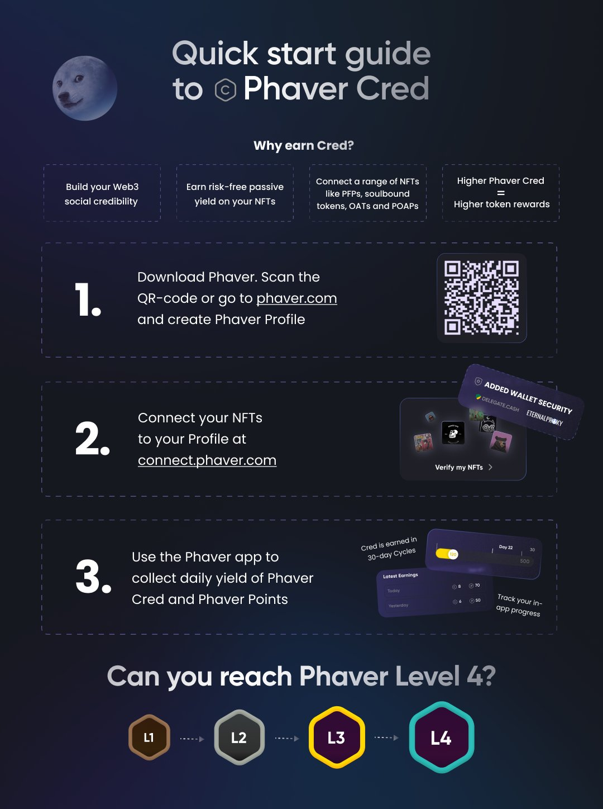

# Orb Communities - Be a part of something bigger

Orb has many communities where people with similar interests can gather. It’s a friendly place to meet others, share your work, and learn together.

&#x20;Comment

Just click on the “👥” icon from the homepage to start discovering these communities.

<figure><figcaption></figcaption></figure>

Orb has a variety of communities covering all walks of life. Here are some popular ones:

&#x20;Comment

* `Developers`: Communities like Developers, buildspace, Alchemy University, and Developer DAO for coding enthusiasts.
* `Anime`: Communities like anime and galverse for anime lovers.
* `LifeStyle`: Communities like Lisbon Life for sharing lifestyle experiences


If you can not find a community you are looking for, [reachout out to us](https://docs.google.com/forms/d/e/1FAIpQLScE8P5IjOUuYKa2yTNANgN7p3\_QlY1NDXK4ZBeZ56mxgp9Dzg/viewform) to request your own.

